<table>
<tr>
<td width="60%" valign="top">

I turn complex ideas into scalable products. With <b>10+ years</b> building <b>data-driven platforms</b>, <b>AI-powered tools</b>, and <b>world-class web applications</b>, I specialize in taking projects from 0→1 and scaling them to production.

🚀 <b>Currently Building:</b> <a href="https://guidehive.app/">GuideHive</a> – Full-stack social marketplace connecting adventurers with local outdoor guides

</td>
<td width="40%" valign="top" align="center">

</td>
</tr>
</table>

---

## 🛠️ Tech Stack

<table>
<tr>
<td valign="top" width="50%">
<h4>🎨 Frontend & UI</h4>
 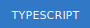 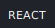     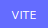   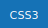   
 
<h4>🛠️ Tools & Workflow</h4>
 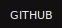    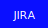  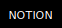
 
<h4>🗄️ Databases</h4>
    
 
<h4>📝 CMS & Content</h4>
   
 
<h4>✨ Creative & Visualization</h4>
  
</td>
<td valign="top" width="50%">
<h4>☁️ AWS Ecosystem</h4>
 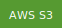        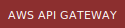 
 
<h4>⚙️ Backend & Infrastructure</h4>
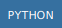  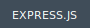  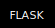   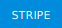   
 
<h4>☁️ Cloud & DevOps</h4>
  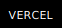  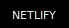   
 
<h4>🧠 Data Science & AI</h4>
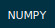 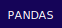  
</td>
</tr>
</table>

---

## 🚀 Featured Projects

### **Production Apps**
* **[🐝 GuideHive](https://guidehive.app/)** – Full-featured social marketplace for the outdoor economy. Built with React Native (mobile), Next.js (web), Node.js + PostgreSQL backend, Stripe payments, real-time chat, and Firebase authentication.

### **Developer Tools & Boilerplates**
* **[Nextplate](https://github.com/3okash/Nextplate)** – The ultimate Next.js boilerplate for rapid development. Pre-configured with TypeScript, Tailwind, ESLint, and best practices.
* **[Nextpen](https://github.com/3okash/nextpen)** – Sleek, full-featured Next.js blog platform built for performance and SEO.

### **AI & Data Projects**
* **[Newscoop](https://newscoop.streamlit.app)** – AI news auditor that surfaces narrative bias and media blind spots using NLP and sentiment analysis.
* **[Persona Pulse](https://3okash.github.io/PersonaPulse/)** – Inferred user persona analysis system via Flask microservices and React UI.
* **[Headliner](https://3okash.github.io/headliner/)** – Predicts emotional and social impact of headlines using DistilBERT transformers and K-Means clustering.

### **Data Visualization & Creative**
* **[How the US Voted](https://3okash.github.io/us_votes)** – Interactive US election data visualization with dynamic hybrid map/timeline built in React and SVG.
* **[SynthChord](https://3okash.github.io/synthchord/)** – Real-time audio synthesis guitar using Tone.js and P5.js for generative music.
* **[Stylus](https://3okash.github.io/stylus/)** – Geometric drawing tool exploring symmetry, patterns, and algorithmic art with P5.js.

**[→ View More Projects](https://3okash.github.io/home/projects)**

---

